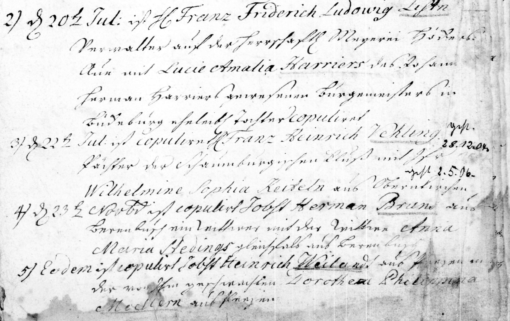

Figure Test
===========

   This is the caption of the figure (a simple paragraph).

   The legend consists of all elements after the caption.  In this
   case, the legend consists of this paragraph and the following
   table:

   +-----------------------+-----------------------+
   | Symbol                | Meaning               |
   +=======================+=======================+
   | .. image:: t1.jpg     | test using archion    |
   +-----------------------+-----------------------+
   | .. image:: t2.jpg     | test using archion    |
   +-----------------------+-----------------------+

